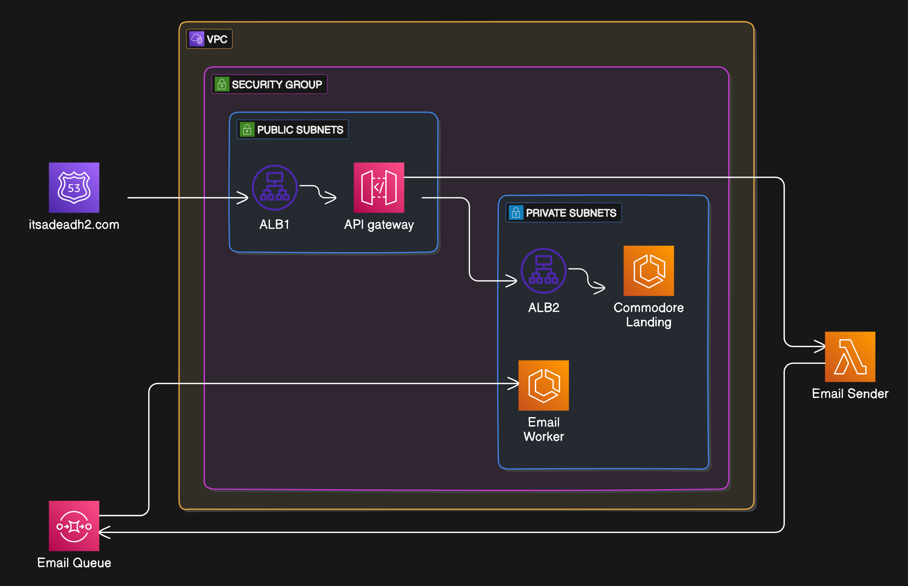

# Services Layout

The following image represents the current services layout.

When we strip away the underlying infrastructure tools, we are left with the following services:
- **[API Gateway](https://itsadeadh2.com)**
- **[Commodore Landing](https://itsadeadh2.com)**
- **[Email Sender](https://itsadeadh2.com)**
- **[Email Worker](https://itsadeadh2.com)**

The main idea behind this layout is to isolate most services from incoming internet traffic for security reasons while allowing inter-service communication.

Additionally, I want the flexibility to run asynchronous operations, jobs, databases, storage systems, or any other services, and only expose what I choose through the **API Gateway**.

You can find more details about each of these services by clicking on them in the list above.
